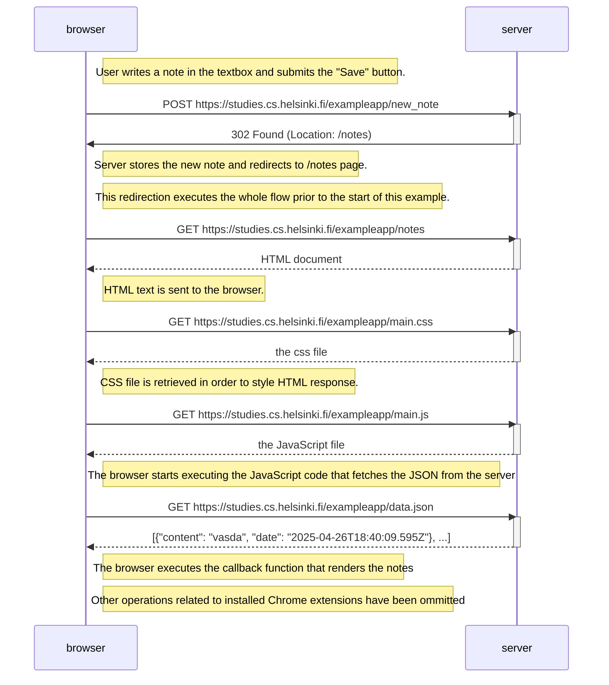

```mermaid
sequenceDiagram
    participant browser
    participant server

    Note right of browser: User writes a note in the textbox and submits the "Save" button.
    browser->>server: POST https://studies.cs.helsinki.fi/exampleapp/new_note
    activate server

    server->>browser: 302 Found (Location: /notes)
    deactivate server
    Note right of browser: Server stores the new note and redirects to /notes page.

    Note right of browser: This redirection executes the whole flow prior to the start of this example.

    browser->>server: GET https://studies.cs.helsinki.fi/exampleapp/notes
    activate server
    server-->>browser: HTML document
    deactivate server
    Note right of browser: HTML text is sent to the browser.

    browser->>server: GET https://studies.cs.helsinki.fi/exampleapp/main.css
    activate server
    server-->>browser: the css file
    deactivate server
    Note right of browser: CSS file is retrieved in order to style HTML response.

    browser->>server: GET https://studies.cs.helsinki.fi/exampleapp/main.js
    activate server
    server-->>browser: the JavaScript file
    deactivate server

    Note right of browser: The browser starts executing the JavaScript code that fetches the JSON from the server

    browser->>server: GET https://studies.cs.helsinki.fi/exampleapp/data.json
    activate server
    server-->>browser: [{"content": "vasda", "date": "2025-04-26T18:40:09.595Z"}, ...]
    deactivate server

    Note right of browser: The browser executes the callback function that renders the notes

    Note right of browser: Other operations related to installed Chrome extensions have been ommitted
```