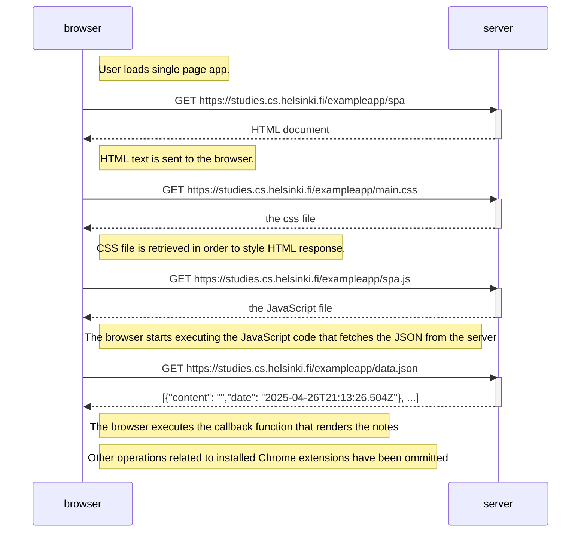

```mermaid
sequenceDiagram
    participant browser
    participant server

    Note right of browser: User loads single page app.
    browser->>server: GET https://studies.cs.helsinki.fi/exampleapp/spa
    activate server
    server-->>browser: HTML document
    deactivate server
    Note right of browser: HTML text is sent to the browser.

    browser->>server: GET https://studies.cs.helsinki.fi/exampleapp/main.css
    activate server
    server-->>browser: the css file
    deactivate server
    Note right of browser: CSS file is retrieved in order to style HTML response.


    browser->>server: GET https://studies.cs.helsinki.fi/exampleapp/spa.js
    activate server
    server-->>browser: the JavaScript file
    deactivate server

    Note right of browser: The browser starts executing the JavaScript code that fetches the JSON from the server

    browser->>server: GET https://studies.cs.helsinki.fi/exampleapp/data.json
    activate server
    server-->>browser: [{"content": "","date": "2025-04-26T21:13:26.504Z"}, ...]
    deactivate server

    Note right of browser: The browser executes the callback function that renders the notes

    Note right of browser: Other operations related to installed Chrome extensions have been ommitted
```