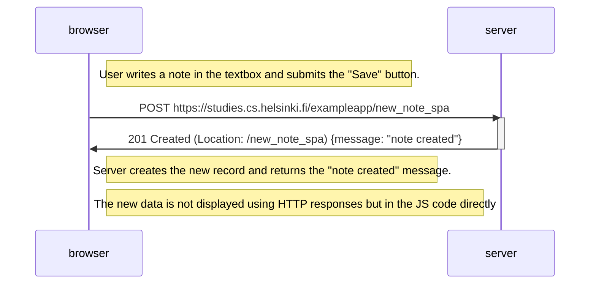

```mermaid
sequenceDiagram
    participant browser
    participant server

    Note right of browser: User writes a note in the textbox and submits the "Save" button.
    browser->>server: POST https://studies.cs.helsinki.fi/exampleapp/new_note_spa
    activate server

    server->>browser: 201 Created (Location: /new_note_spa) {message: "note created"}
    deactivate server
    Note right of browser: Server creates the new record and returns the "note created" message. 
    Note right of browser: The new data is not displayed using HTTP responses but in the JS code directly

```